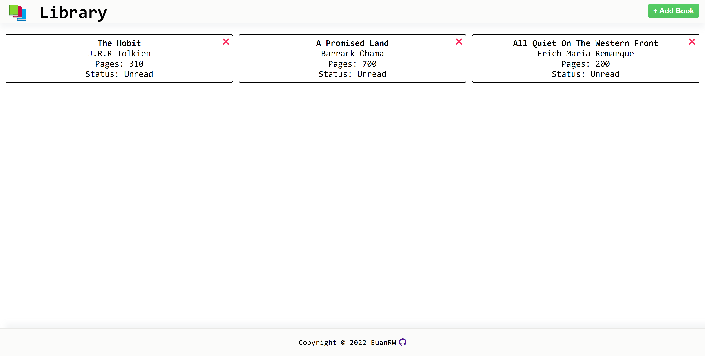

# library
[Live Demo](https://euanrw.github.io/library/) :point_left:  
A simple library app created using JS, HTML & CSS.

## Objectives
- Demonstrate CRUD Actions.
- Use HTML Forms.
- JS DOM Manipulation.

## Project Status
Complete

## Project Screen Shot(s)

## Installation and Setup Instructions

Drag the html file into your browser.